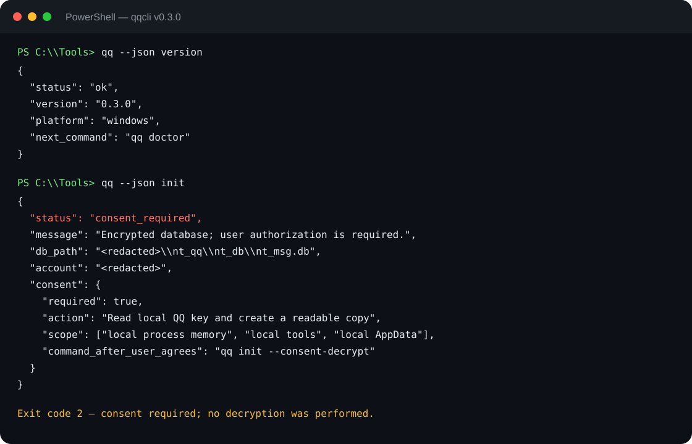

# Windows QQ chat history search and export with qqcli

> Search local QQ NT chat history, inspect sessions, and export a user-approved conversation from Windows. Download the verified installer from the [latest qqcli Release](https://github.com/2233admin/qqcli-rs/releases/latest).



*The screenshot shows the real v0.3.0 JSON contract with the account and local path redacted. Exit code 2 means qqcli paused for user consent; it did not decrypt anything.*

## English

### What this tool is for

`qqcli` is a Windows-first Rust CLI for **QQ chat history search, QQ NT local database access, chat export, and backup**. It is useful when you need to find an old message, address, file name, or work conversation without opening QQ and scrolling through years of history.

The current release supports Windows and QQ NT local data. QQ must have run on the computer at least once. Linux and macOS are not supported installation targets yet.

### Install in four steps

1. Open the [latest Release](https://github.com/2233admin/qqcli-rs/releases/latest).
2. Download the Windows ZIP and `SHA256SUMS.txt`.
3. Verify the ZIP, extract it, and run `install.cmd`.
4. Open a new PowerShell window and run:

```powershell
qq init
```

The installer checks the version manifest, `qq.exe --version`, and the required `duckdb.dll`. Verify SHA-256 before installation because code signing is not available yet.

### Search QQ chat history

```powershell
qq sessions
qq index
qq search "meeting"
qq history <session-id> --since 2024-01-01
```

`sessions`, `history`, and `search` are local **Read Access** operations. They do not grant permission to export or send data.

### Export one selected conversation

Export is a separate **External Disclosure** action. First confirm the exact session, output format, and destination with the Human User:

```powershell
qq --json export <session-id> -o chat.md
```

If the user approves the returned scope, run:

```powershell
qq export <session-id> -o chat.md --consent-external-disclosure
```

The same boundary applies to `qq bundle` and `qq sync`. A read operation never silently becomes an export.

### Use qqcli from an AI Agent

```powershell
qq --json version
qq --json init
# Show the returned consent.scope to the Human User.
# Only after explicit approval:
qq --json init --consent-decrypt
```

The Agent contract is stable:

- `0` means the operation completed;
- `2` means consent is required and the Agent must pause;
- `3` means setup or repair is required; follow `next_command` or run `qq doctor --json`.

The Agent must not invent consent, skip the consent step, or expose keys. Diagnostics redact user paths and never include keys, message bodies, or process memory.

### Download qqcli

Ready to try it? [Download the Windows Release](https://github.com/2233admin/qqcli-rs/releases/latest), then return to the [main project page](https://github.com/2233admin/qqcli-rs) for the command reference.

## 简体中文

### 这个工具解决什么问题？

`qqcli` 是一个面向 Windows 的 Rust 命令行工具，用于 **QQ 聊天记录搜索、QQ NT 本地数据库访问、聊天记录导出和备份**。如果你想找回以前发过的地址、文件名或工作消息，不需要打开 QQ，也不需要手动翻很多年的聊天记录。

当前发布版支持 Windows 和 QQ NT 本地数据。电脑上需要至少运行过一次 QQ。Linux 和 macOS 目前不是受支持的安装目标。

### 四步安装

1. 打开[最新 Release](https://github.com/2233admin/qqcli-rs/releases/latest)；
2. 下载 Windows ZIP 和 `SHA256SUMS.txt`；
3. 校验 ZIP，解压后运行 `install.cmd`；
4. 重新打开 PowerShell，执行：

```powershell
qq init
```

安装器会检查版本清单、`qq.exe --version` 和必需的 `duckdb.dll`。目前还没有代码签名，安装前必须先校验 SHA-256。

### 搜索 QQ 聊天记录

```powershell
qq sessions
qq index
qq search "会议"
qq history <会话ID> --since 2024-01-01
```

`sessions`、`history`、`search` 都是本地 **Read Access（读取）** 操作，不会自动获得导出或发消息权限。

### 导出一个指定会话

导出属于独立的 **External Disclosure（外部披露）** 动作。先和用户确认准确的会话、格式和目标路径：

```powershell
qq --json export <会话ID> -o chat.md
```

用户明确同意返回的授权范围后，再执行：

```powershell
qq export <会话ID> -o chat.md --consent-external-disclosure
```

`qq bundle` 和 `qq sync` 使用相同的授权边界。读取操作不会静默升级为导出操作。

### 给 AI Agent 使用

```powershell
qq --json version
qq --json init
# Agent 先把返回的 consent.scope 展示给用户。
# 用户明确同意后才能执行：
qq --json init --consent-decrypt
```

Agent 合约保持稳定：

- `0`：操作完成；
- `2`：需要授权，Agent 必须暂停并等待用户决定；
- `3`：需要配置或修复，按 `next_command` 执行，或运行 `qq doctor --json`。

Agent 不得伪造同意、跳过授权或暴露密钥。诊断报告会脱敏用户路径，不包含密钥、消息正文或进程内存。

### 下载 qqcli

现在就可以[下载 Windows Release](https://github.com/2233admin/qqcli-rs/releases/latest)，然后回到[项目主页](https://github.com/2233admin/qqcli-rs)查看完整命令说明。

## Report a problem / 反馈问题

If setup fails, run `qq doctor --json` and remove any personal paths before opening an issue.  
如果安装或初始化失败，请运行 `qq doctor --json`，删除个人路径后再提交 Issue。
